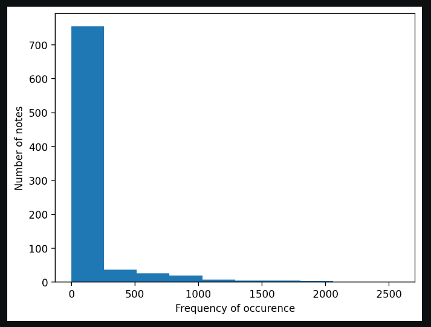

# Music-Generator
This project casts its focus on automatic music generation via two popular approaches:
* WaveNet
* LSTM

The remarkable ability of deep learning networks to automatically extract features from the dataset makes them great candidates for automatic music generation. Both WaveNet and LSTM are examples of deep learning networks.

# Resutls
Follow this link to view some of the music files generated by the model.
https://iiitaphyd-my.sharepoint.com/:f:/g/personal/abhay_patil_students_iiit_ac_in/EhffXgxeEaNEtzrwY1yrEroBJlKXYWPK-JhWziSRqti2XQ?e=iq15AI

## WaveNet
WaveNet is a deep learning based generative model for raw audio developed by Google DeepMind. The main objective of WaveNet is to generate new samples from the original distrubution of data, making it a Generative model. The structure of WaveNet is similar to a language model from NLP. Instead of predicting the next word from a sentence, we predict the next note from a sequence of notes and chords.

## Input and Output
WaveNet takes a chunk of raw audio as input. Raw audio refers to the representation of a wave in the time-series domain, where an audio wave is recorded at different intervals of time, which depends on the sampling rate. Given a sequence of notes, we predict the next successive note, which serves as the output.

## Architecture
The building blocks of WaveNet are `Casual Dilated 1D Convolution Layers`. A convolution is a mathematical operation that is essentially a linear combination of a kernel and portions of the image. This is done in order to drastically reduce the number of inputs. In image processing, we would require 2D convolution, but in our case a 1D convolution suffices. The kernel scans the sequence of notes.

## Steps
1. From a collection of MIDI files, we collect all notes and chords into one list. There is no reason for us to separate the notes from different songs.
2. We eliminate the notes that appear rarely to avoid outliers and simplify the training process.
 
(In this case, there were over 700 notes which occured less than 250 times, we eliminated notes that fall under this bracket with a threshold of around 40)
3. Prepare input-output pairs for the model. (Input - sequence of notes, Output - successive note)
4. Convert the notes into numbers via a one-to-one mapping for the model
5. Build the model
6. Compose new music
7. Convert numbers back to notes by reversing the one-to-one mapping